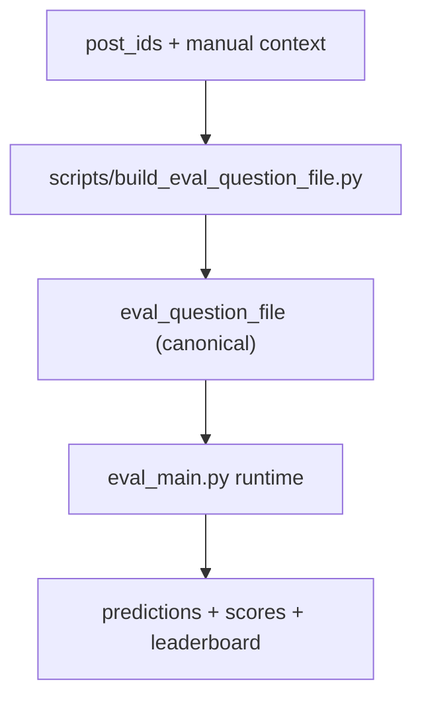

# Eval Framework README

This eval system now uses a **single runtime question artifact**: `eval_question_file`.

Runtime no longer reads Metaculus IDs or raw manual context directly.
All Metaculus/manual-context quirks are isolated in a dataset-builder script.
Per-question run count is now configured per strategy via `num_runs` in strategy YAML.

## 1) Architecture

Two explicit phases:

1. Build phase (data assembly)
- Input: `post_ids` + manual context file
- Action: fetch resolution/timestamps from Metaculus API2 and merge with manual context
- Output: canonical `eval_question_file`

2. Runtime phase (backtest execution)
- Input: `eval_question_file` + strategy files
- Action: run strategies, score, report
- No question assembly, no Metaculus loading



## 2) Runtime Contract

`eval_main.py` now accepts:
- `--eval-question-file` (required)
- `--strategy-files` (required)
- `--question-concurrency`
- `--output-dir`

Removed from runtime:
- `--post-ids`
- `--context-file`

## 3) Builder Script

Path:
- `scripts/build_eval_question_file.py`

Inputs:
- `--post-ids ...` (required)
- `--context-file ...` (required)
- `--output-file ...` (required)
- `--overwrite` (optional)

Builder-only dependencies:
- `src/eval/manual_context_loader.py`
- `src/eval/metaculus_resolution_loader.py`

## 4) `eval_question_file` Schema

Top-level object:

```json
{
  "schema_version": "v1",
  "generated_at": "ISO8601",
  "source": {
    "builder": "scripts/build_eval_question_file.py",
    "post_ids": [39523, 39575, 39476],
    "context_file": "eval_inputs/resolved_context_39523_39575_39476.json"
  },
  "questions": [
    {
      "post_id": 39523,
      "question_id": 123,
      "title": "...",
      "type": "binary",
      "description": "...",
      "resolution_criteria": "...",
      "fine_print": "...",
      "label": 1,
      "resolution_raw": "yes",
      "status": "resolved",
      "open_time": "2025-10-21T17:26:35Z",
      "actual_resolve_time": "2025-12-31T00:00:00Z",
      "metadata": {}
    }
  ]
}
```

Rules:
- `schema_version` must be `v1`
- `questions` must be non-empty
- each row must be fully evaluatable (no runtime join)
- `type` must be `binary`
- `label` must be `0` or `1`
- `status` must be `resolved`
- `open_time` required ISO datetime

Runtime validator:
- `src/eval/eval_question_file_loader.py`

## 5) End-to-End Usage

## 5.1 Build canonical question file

```bash
.venv/bin/python scripts/build_eval_question_file.py \
  --post-ids 39523 39575 39476 \
  --context-file eval_inputs/resolved_context_39523_39575_39476.json \
  --output-file eval_inputs/eval_questions_39523_39575_39476.json
```

## 5.2 Run eval

```bash
.venv/bin/python eval_main.py \
  --eval-question-file eval_inputs/eval_questions_39523_39575_39476.json \
  --strategy-files eval_inputs/strategies/nano_baseline.yaml \
  --question-concurrency 3 \
  --output-dir logs/evals
```

### 5.3 Strategy YAML note

`num_runs` is required in each strategy file.

Strategies can now directly control common forecast knobs:
- `outside_view_model` -> `OUTSIDE_VIEW_MODEL`
- `inside_view_model` -> `INSIDE_VIEW_MODEL`
- `final_forecast_model` -> `FINAL_FORECAST_MODEL`
- `summary_model` -> `SUMMARY_MODEL`
- `reasoning_effort` -> `REASONING_EFFORT`
- `final_forecast_reasoning_effort` -> `FINAL_FORECAST_REASONING_EFFORT`
- `tool_summary_reasoning_effort` -> `TOOL_SUMMARY_REASONING_EFFORT`

Notes:
- When `force_nano_models` is enabled in loader usage, nano is only the default for unspecified model fields.
- Explicit strategy model fields (or `model_overrides`) take precedence.
- `env_overrides` still works for advanced/custom keys.

Example:

```yaml
id: nano_baseline
enabled: true
num_runs: 1
outside_view_enabled: true
inside_view_enabled: true
prediction_market_enabled: false
final_forecast_use_agent: false
outside_view_model: gpt-5-nano
inside_view_model: gpt-5-nano
final_forecast_model: gpt-5-nano
summary_model: gpt-5-nano
reasoning_effort: medium
final_forecast_reasoning_effort: medium
tool_summary_reasoning_effort: medium
```

## 6) Runtime Behavior

Runtime loads only:
- eval questions from `eval_question_file`
- strategy config from YAML

Then per strategy/question:
- run forecast pipeline (non-submitting)
- score predictions (Brier/log-loss)
- aggregate calibration/ECE
- write artifacts

Outputs under:
- `logs/evals/<run_id>/`

Artifacts:
- `predictions.jsonl`
- `strategy_summary.csv`
- `leaderboard.md`
- `calibration_<strategy_id>.csv`
- `run_config_snapshot.json`

## 7) Leakage Controls (unchanged)

- As-of time per question comes from `open_time` in `eval_question_file`
- Exa timeboxing remains active
- `exa_answer_tool` removed from available tools in eval mode
- AskNews uses provider-side timestamps and local hard cutoff

## 8) Developer Checks

Targeted eval tests:

```bash
.venv/bin/pytest -q \
  tests/test_eval_question_file_loader.py \
  tests/test_build_eval_question_file.py \
  tests/test_eval_main_cli_contract.py \
  tests/test_eval_context_loader.py \
  tests/test_eval_resolution_loader.py
```

Full suite:

```bash
.venv/bin/pytest -q
```
