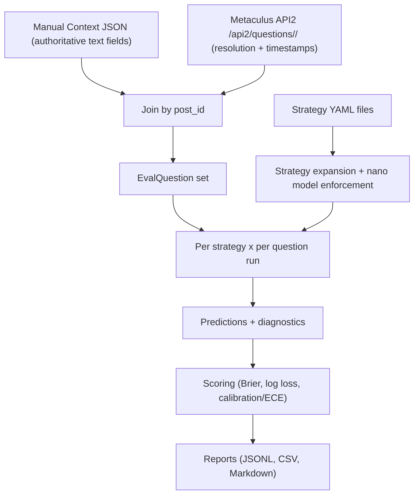

# Eval Framework README

This document explains the resolved-question backtesting framework in this repository.

It covers:
- what the eval system does
- how data flows through it
- input/output formats
- leakage controls (AskNews + Exa)
- how to run and troubleshoot

## 1) Purpose

The eval framework runs forecasting strategies against **already resolved** Metaculus questions, then ranks strategies primarily by **mean Brier score**.

This is implemented as a non-submitting offline backtest:
- no prediction submission to Metaculus
- no train/test split (single evaluation set)
- binary questions only (v1)

## 2) High-level flow



## 3) Code map

Core modules:
- `src/eval/types.py`
- `src/eval/manual_context_loader.py`
- `src/eval/metaculus_resolution_loader.py`
- `src/eval/strategy_config.py`
- `src/eval/timebox.py`
- `src/eval/runner.py`
- `src/eval/scoring.py`
- `src/eval/reporting.py`
- `eval_main.py`

Current prepared input artifacts:
- `eval_inputs/resolved_context_39523_39575_39476.json`
- `eval_inputs/strategies/nano_baseline.yaml`

## 4) Data sources and joining

### 4.1 Manual context (authoritative)

Context text is loaded from a strict local JSON file. For each row:
- `description`
- `resolution_criteria`
- `fine_print`

are mandatory and authoritative for eval.

### 4.2 Resolution + timestamps

For each `post_id`, the loader calls:
- `https://www.metaculus.com/api2/questions/<post_id>/`

It reads:
- `question.status` (must be `resolved`)
- `question.resolution` (`yes`/`no`)
- `question.open_time`
- `question.actual_resolve_time`

Resolution labels are normalized:
- `yes -> 1`
- `no -> 0`

### 4.3 Join contract

Join key:
- `post_id`

Eval fails hard if:
- context row missing
- required context fields missing/empty
- API2 status is not `resolved`
- resolution is not `yes` or `no`

## 5) Input formats

## 5.1 Context JSON schema

Accepted top-level forms:
- list of question objects
- object with `questions: [...]`

Required fields per row:
- `post_id` (int)
- `title` (non-empty string)
- `type` (`binary`)
- `description` (non-empty string)
- `resolution_criteria` (non-empty string)
- `fine_print` (non-empty string)

Optional:
- `metadata` (object)

Example:

```json
{
  "questions": [
    {
      "post_id": 39523,
      "title": "Will China be able to mass produce humanoid robots by the end of 2025?",
      "type": "binary",
      "description": "...",
      "resolution_criteria": "...",
      "fine_print": "...",
      "metadata": {"source": "user_manual_context"}
    }
  ]
}
```

## 5.2 Strategy YAML schema

Top-level can be:
- single strategy object
- list of strategy objects
- object with `strategies: [...]`

Required per strategy:
- `id` (string)
- `enabled` (bool)

Optional toggles:
- `outside_view_enabled` (default `true`)
- `inside_view_enabled` (default `true`)
- `prediction_market_enabled` (default `false`)
- `final_forecast_use_agent` (default `true`)
- `env_overrides` (map)
- `model_overrides` (map)

Important:
- eval runner enforces nano models (`gpt-5-nano`) regardless of strategy model values.

Example:

```yaml
id: nano_baseline
enabled: true
outside_view_enabled: true
inside_view_enabled: true
prediction_market_enabled: false
final_forecast_use_agent: true
env_overrides:
  LOG_ENABLE: "true"
```

## 6) CLI

Entrypoint:
- `eval_main.py`

Arguments:
- `--post-ids` (required)
- `--context-file` (required)
- `--strategy-files` (required, no default bundle)
- `--num-runs` (default `1`)
- `--output-dir` (default `logs/evals`)
- `--question-concurrency` (default `1`, run questions in parallel per strategy)

Example (current 3-question setup):

```bash
.venv/bin/python eval_main.py \
  --post-ids 39523 39575 39476 \
  --context-file eval_inputs/resolved_context_39523_39575_39476.json \
  --strategy-files eval_inputs/strategies/nano_baseline.yaml \
  --num-runs 1 \
  --question-concurrency 3 \
  --output-dir logs/evals
```

## 7) Scoring and ranking

Per prediction row:
- Brier score: `(p - y)^2`
- Log loss: epsilon-clipped binary log loss

Per strategy aggregate:
- mean Brier
- mean log loss
- calibration bins
- ECE
- mean cost
- mean latency

Leaderboard sort order:
1. mean Brier ascending
2. mean log loss ascending
3. ECE ascending
4. mean cost ascending

## 8) Outputs

For each run:
- output root: `logs/evals/<timestamp_run_id>/`

Files:
- `predictions.jsonl`
- `strategy_summary.csv`
- `leaderboard.md`
- `calibration_<strategy_id>.csv`
- `run_config_snapshot.json`

## 9) Timeboxing and leakage controls

Eval sets per-question `as_of_time = open_time`.

This propagates into prompts and tools.

### 9.1 Prompt-time date anchoring

`today` in prompt templates is replaced with question `as_of_time` date (YYYY-MM-DD), not wall-clock now.

### 9.2 Exa controls

There are two Exa paths:
- agent tool path (`src/agent_infrastructure.py`)
- historical Exa utility path (`src/exa_utils.py`)

Current controls:
- provider-side cutoff:
  - `end_published_date = EVAL_AS_OF_TIME` (or strategy/question override)
- local hard cutoff (utility path):
  - local post-filter removes anything after cutoff
- `exa_answer_tool` is **not available** when `EVAL_AS_OF_TIME` is set:
  - eval active tool list excludes `exa_answer_tool`
  - this prevents non-timeboxable answer endpoint leakage

### 9.3 AskNews controls

AskNews search uses provider-side timestamps and local hard cutoff:

Provider-side:
- `time_filter="pub_date"`
- `end_timestamp = as_of_time`
- for latest lane:
  - `start_timestamp = as_of_time - 48h`
  - `historical=false`
- for archive lane:
  - `historical=true`
  - `end_timestamp = as_of_time`

Local hard cutoff:
- post-fetch timebox filter removes any article with publish time after `as_of_time`.

### 9.4 Practical leakage notes

Even with time filters:
- provider timestamps may be incomplete/late for some items
- relevance filtering is LLM-based and can keep/remove imperfectly

Defense-in-depth currently used:
- Exa: provider + local (utility path), plus answer tool disabled in eval
- AskNews: provider + local

## 10) Environment requirements

Minimum for full eval run:
- `METACULUS_TOKEN` (for `/api2/questions/<post_id>/`)
- `OPENROUTER_API_KEY` (LLM calls)
- `EXA_API_KEY` (Exa tools)
- `ASKNEWS_CLIENT_ID` and `ASKNEWS_SECRET` (AskNews)

Optional:
- standard logging env vars (`LOG_*`, Supabase logging toggles, etc.)

## 11) Runtime behavior

- eval is non-submitting (`submit_prediction=false` path)
- strategy/question runs execute sequentially in runner
- each strategy/question run captures:
  - runtime
  - token/cost
  - tool call and cache counts
  - AskNews fetched/removed stats
  - errors

Failure behavior:
- if a particular strategy/question run fails, the row is recorded with `error`
- failed rows get `inf`-style aggregate penalties and naturally rank worse

## 12) Known limitations (v1)

- binary only
- no train/test split
- no statistical significance tests
- no bootstrap confidence intervals for leaderboard
- AskNews stats currently track relevance-filter removals; timebox removals are printed/logged separately

## 13) Extending the framework

Potential next steps:
- add confidence intervals via bootstrap over questions
- add paired significance tests between strategies
- add pluggable dataset registry (multiple fixed backtest sets)
- add strict mode report section listing all tool evidence timestamps
- add deterministic replay mode for cached tool/LLM outputs

## 14) Developer quick checks

Run eval tests:

```bash
.venv/bin/pytest -q tests/test_eval_context_loader.py \
  tests/test_eval_resolution_loader.py \
  tests/test_eval_strategy_config.py \
  tests/test_eval_scoring.py \
  tests/test_eval_reporting.py \
  tests/test_eval_timebox_filters.py
```

Run all tests:

```bash
.venv/bin/pytest -q
```

## 15) FAQ

### Why manual context instead of Metaculus detail endpoint fields?

Resolved question detail endpoints can have missing/null text fields; manual context avoids brittle dependency and keeps dataset reproducible.

### Why enforce nano models in eval?

Cost control and consistent strategy comparison baseline.

### Why disable Exa answer tool in eval?

That endpoint is not reliably time-filterable; disabling removes a leakage channel.
